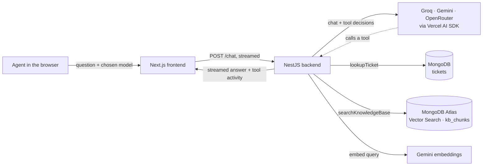

# AutoCare Copilot

**An AI assistant for auto-service support agents.** It answers ticket, diagnostic-code and policy questions from real data — looking up the actual ticket instead of guessing, and grounding every how-to answer in the company's own knowledge base, with the source shown.

Next.js
NestJS
MongoDB
Vercel AI SDK
TypeScript

AutoCare Copilot — ticket summary, tool calls and cited knowledge-base sources

## The problem

Support agents answering a breakdown call have to juggle several things at once: the ticket's current status, what a diagnostic code means, and what the policy says about towing, warranties or cancellations. That usually means switching between tools, or answering from memory — slow, and inconsistent between agents.

AutoCare Copilot puts all of it behind one chat, built for the people *providing* the service (not the customers calling in).

## What it does

- **Streaming chat** — answers appear token by token.
- **Tool calling for exact data** — "what's the status of ticket 4?" makes the model call `lookupTicket`, which reads the real record from MongoDB. It never invents ticket details.
- **RAG over a knowledge base** — diagnostic codes, service policies and FAQs are embedded into MongoDB Atlas Vector Search. The model calls `searchKnowledgeBase` and answers only from what comes back, citing the source doc.
- **Structured summaries** — one click turns a ticket into validated JSON (`title`, `keyPoints[]`, `suggestedAction`) instead of free text.
- **Multiple AI providers** — Groq, Gemini and OpenRouter behind one interface, switchable from the UI.
- **Measured, not guessed** — a small eval harness scores every provider on the same 10 questions.


## How it works




The frontend only displays. The backend is the only piece that talks to the AI providers and the database: it hands the model a fixed menu of tools, and the model can only reach real data by asking for one. More detail, and the step-by-step build log, in [docs/architecture.md](docs/architecture.md).

## Provider results

Same prompt, tools, retrieval and 10 questions for each provider ([method and caveats](docs/evaluation.md)):


| Provider · model                     | Correct                     | Right tool | Avg answer time | Free-tier friction        |
| ------------------------------------ | --------------------------- | ---------- | --------------- | ------------------------- |
| **Groq** · `openai/gpt-oss-120b`     | **10/10**                   | 10/10      | **~1.4 s**      | none hit                  |
| OpenRouter · `qwen/qwen3.8-27b:free` | 9/10                        | 9/10       | ~6 s            | occasional 429            |
| Gemini · `gemini-3.6-flash`          | 5/10 (7/7 when it answered) | 6/10       | ~5.5 s          | 5 req/min, **20 req/day** |


Gemini's answers were all correct — its free quota wasn't enough for a tool-using assistant, so **Groq is the default** chat model and Gemini is kept for embeddings. Full write-up: [docs/comparison.md](docs/comparison.md).

## Tech stack


| Layer    | Tech                                                                                           |
| -------- | ---------------------------------------------------------------------------------------------- |
| Frontend | Next.js 16 (App Router), React 19, Tailwind CSS 4, `@ai-sdk/react` (`useChat`), react-markdown |
| Backend  | NestJS 11, Mongoose, Vercel AI SDK 6 (`streamText`, tools, `Output.object`), Zod               |
| AI       | Groq, Google Gemini (chat + `gemini-embedding-001`), OpenRouter                                |
| Data     | MongoDB Atlas (free M0) with Atlas Vector Search                                               |


## Getting started

**You need:** Node.js 20+, a free [MongoDB Atlas](https://www.mongodb.com/cloud/atlas) M0 cluster, and a free [Google AI Studio](https://aistudio.google.com/) API key. Optional: free [Groq](https://console.groq.com/) and [OpenRouter](https://openrouter.ai/) keys — each one you add shows up in the model picker.

```bash
git clone <this-repo> autocare-copilot && cd autocare-copilot

# 1. One env file for the backend and scripts
cp .env.example .env          # fill in GEMINI_API_KEY and MONGODB_URI (+ optional GROQ/OPENROUTER keys)

# 2. Install
npm install --prefix scripts
npm install --prefix apps/backend
npm install --prefix apps/frontend

# 3. Load the data: 10 sample tickets + the knowledge base (embeds 20 docs, creates the vector index)
node --env-file=.env scripts/seed-tickets.js
node --env-file=.env scripts/ingest-knowledge-base.js

# 4. Run (two terminals)
npm run start:dev --prefix apps/backend     # http://localhost:3001
npm run dev --prefix apps/frontend          # http://localhost:3000
```

> In Atlas → **Network Access**, allow your current IP. A blocked IP shows up as a confusing TLS error rather than an "access denied".
> The vector index takes a minute or two to build after the ingest script creates it.

Optional checks:

```bash
node --env-file=.env scripts/gemini-raw-check.js      # raw Gemini call, no SDK
node --env-file=.env scripts/mongo-connection-check.js
node scripts/eval.js                                  # backend must be running
```


## Project structure

```
apps/
  frontend/          Next.js UI — features/chat, features/tickets, api/ client layer
  backend/           NestJS API — ai (provider registry), chat (tools), tickets, knowledge-base
knowledge-base/      20 markdown docs: diagnostic codes, service policies, FAQs
scripts/             seed, ingest, eval, and raw connectivity checks
docs/
  architecture.md    how the pieces connect + build log per milestone
  comparison.md      provider comparison
  evaluation.md      eval method, questions and results
  cheat-sheet.md     copy-paste snippets for adding AI to a TypeScript project
```


## How this was built

A one-week learning project on AI-integrated full-stack development, built in small milestones where each one had to work before starting the next:


| Step | What was added                                                             |
| ---- | -------------------------------------------------------------------------- |
| M0   | Raw Gemini `fetch` call and MongoDB ping — prove each service works alone  |
| M1   | Next.js streaming chat with the Vercel AI SDK                              |
| M2   | NestJS backend, MongoDB tickets, tool calling, structured output           |
| M3   | Knowledge base → embeddings → Atlas Vector Search → RAG tool               |
| M4   | Multi-provider registry and a 10-question eval harness                     |
| M5   | Final UI (tickets panel, summaries, model picker), docs, clean-clone setup |


What changed at each step and why: [docs/architecture.md](docs/architecture.md). Known limitations and next steps are at the end of the same file.


|     |     |
| --- | --- |
|     |     |


